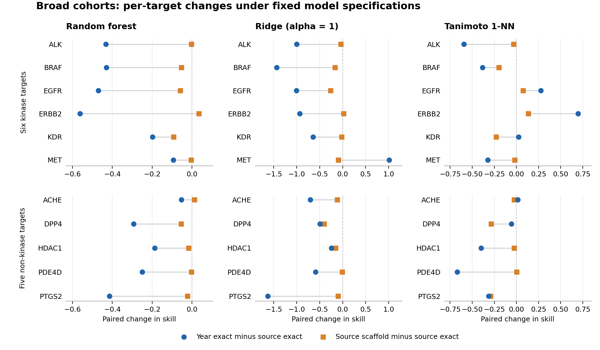
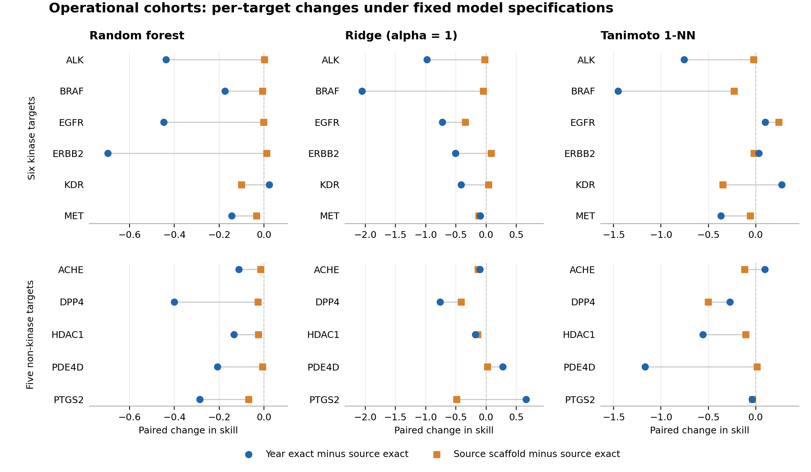

# Holdout-design validation

Companion to *Holdout Design Changes Random Forest Utility Estimates across Six Kinases*.

The complete offline package is `verified_bundle_v1.tar.xz` (SHA-256 in `BUNDLE_SHA256.txt`). It contains frozen inputs, all 680 prediction cases, analysis, fit ledgers and verification records. Root-level scripts are provided for browsing; run the pipeline from the extracted `bundle/` directory.

```sh
python unpack_bundle.py
python -m venv .venv
# Activate .venv, then:
python -m pip install -r bundle/requirements.txt
python -B bundle/verify_release.py
python -B bundle/reproduce.py --output bundle/reproduced_v1
```

A shorter integration run is `python -B bundle/reproduce.py --output bundle/smoke_v1 --quick-check`.

Full Windows runs produced 680 prediction cases; a separate clean-directory smoke check rebuilt all 408 input tables byte-for-byte and freshly fitted two Ridge cases, reproducing both prediction files byte-for-byte. This smoke check has a separate scope from the full runs. See `bundle/verification/clean_directory_check.json`.

Publication state is tracked in the repository-root `PUBLISH_STATUS.json`. The copy inside the sealed bundle records the state at packaging time.





## Main findings

In broad cohorts, median within-target changes in skill (document-year exact minus source-document exact) were−0.431,−0.967,−0.149 for RF,Ridge,Tanimoto1-NN on the six kinases; on the five non-kinase targets they were−0.250,−0.592,−0.314. RF changed in the same direction in6/6 and5/5 targets. Directions vary for the other models. In the non-kinase operational cohort, Ridge's median scaffold-filter change was larger than its year-route change. See `REPORT_CN.md`, `results/analysis/` and `figures/` for all results, absolute errors and exceptions.

The new targets are ACHE,DPP4,PTGS2,HDAC1,PDE4D. CA2 failed the frozen data-count criteria and was not replaced. Selection never used model scores. These are new targets from the same resource; models were trained separately for each target. Data follow database annotations, rather than a new publisher-original audit.

## Contents

- `inputs/current_origin/`: original frozen train/valid/test CSVs, cached assay metadata and initial Policy A.
- `inputs/current_reference/`: current split and training manifests, RF configuration and631-item eligibility policy. Original machine paths are provenance fields; execution resolves package-relative names.
- `inputs/external_raw/`: official API JSON, query URLs, retrieval timestamps and hashes, including all six screened candidates.
- `results/predictions/`:680 prediction cases:480 current-panel cases (including paired-operational sensitivities) and200 new-panel cases.
- `results/analysis/`: row-level losses, target/model summaries, route contrasts, absolute errors, conditional document intervals and paired model intervals.
- `results/fit_ledgers/`: configuration, input signatures, actual fit/index-build times and binary hashes. Model binaries are rebuilt by the training entry and omitted from this bundle.
- `verification/`: input reconstruction and independent numerical checks.
- `PROTOCOL.md`, `EXTERNAL_PROTOCOL.md`, `BOOTSTRAP_PROTOCOL.md`: primary model protocol, score-blind candidate/partition rules, and supplementary conditional interval protocol.
- `FILE_MANIFEST.json`: SHA-256 for the sealed package payload.

## Environment

The full model runs used Windows, Python3.9.10, RDKit2025.09.2, scikit-learn1.6.1, numpy2.0.2, pandas2.3.3, scipy1.13.1 and joblib1.5.3. Dependencies are pinned in `requirements.txt`. Use a dedicated environment. No GPU is required. RF uses two threads; other numerical workers use one thread. The fresh-model runs completed138 RF fits,46 Ridge fits and46 nearest-neighbor indices; repeated contexts reuse identical ordered training inputs/configurations/seeds.

Create an environment, activate it and install the pinned requirements:

```sh
python -m venv .venv
python -m pip install -r requirements.txt
```

The second command must use the activated environment's Python. The validated Python/version details and clean-directory scope are in `verification/clean_directory_check.json`. Linux full training has not been verified.

## Offline end-to-end reproduction

After changing into the extracted `bundle/` directory, use a new output directory for each invocation:

```sh
python -B verify_release.py
python -B reproduce.py --output reproduced_v1
```

The full command rebuilds all288 current input tables from original partitions and policy, prepares the new-target cohorts from cached raw API JSON, checks split integrity, freshly fits RF/Ridge and builds1-NN indices, writes680 prediction cases, independently verifies their metrics and computes2000-replicate conditional whole-document intervals. It uses no network and no archived model binaries.

For faster input validation or a two-case integration smoke check:

```sh
python -B reproduce.py --output preparation_v1 --prepare-only
python -B reproduce.py --output smoke_v1 --quick-check
```

The smoke check freshly fits one Ridge case in each panel and verifies it; it is not a full rerun. Checkpointed direct training may use an explicit `--resume` only after diagnosing an interruption. A live lock or incomplete fit fails rather than silently repeating a fit.

To regenerate the scientific figures, additionally install `matplotlib==3.9.4` and run:

```sh
python -B plot_results.py --analysis results/analysis --output rebuilt_figures
```

## Interpretation and data boundary

Training-mean baselines always use the matching training cohort. RF target results are medians over seeds42,53,67; deterministic models occur once. Panel summaries weight targets equally. Median paired target changes and differences of panel medians are different summaries. Route contrasts compare different test populations; cross-model contrasts within a context use identical rows. Conditional document intervals hold the cohort and fitted models fixed. The Ridge alpha and1-NN rule were fixed before testing, and their results do not represent tuned family optima.

Current-panel reproduction starts from archived partitions and accepted source policies; the new panel starts from frozen official API responses. Full raw ChEMBL database reconstruction and publisher-original certification are outside this package's execution boundary. No biological experiment was performed.

## Licensing and citation

ChEMBL-derived records and metadata retain [CC BY-SA3.0 Unported](https://chembl.gitbook.io/chembl-interface-documentation/about) attribution and terms; see `DATA_LICENSE.md`. Newly authored scripts listed in `CODE_LICENSE_SCOPE.csv` use MIT; see `LICENSE_CODE.txt`. Third-party dependencies retain their own licenses. No publisher PDFs or earlier private review conversations are redistributed.

Data source: ChEMBL37, release DOI [10.6019/CHEMBL.database.37](https://doi.org/10.6019/CHEMBL.database.37). API documentation: [ChEMBL Data Web Services](https://chembl.gitbook.io/chembl-interface-documentation/web-services/chembl-data-web-services). `CITATION.cff` describes this companion package. A package DOI is added only after the actual Zenodo record exists.

The intended publication route is the author's GitHub repository, with a versioned Zenodo archive. See `PUBLICATION.md` for the release sequence and the actual `PUBLISH_STATUS.json` for publication status.
